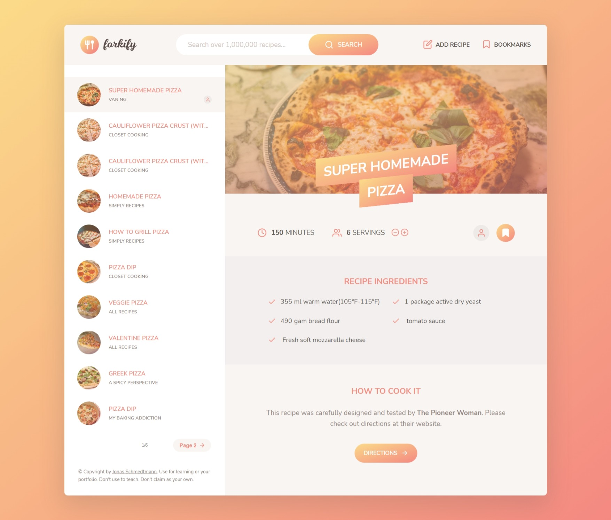

# Forkify project
## About the Project

*Forkify is an application that was built with **HTML, CSS, and Javascript**. The application uses data that was fetched from **Forkify API** to display recipes based on keyword the user had entered.*

[View DEMO](https://forkify-vanhong.netlify.app/)

## Features

1. The Forkify Recipe App allow users to **search for recipes**.
2. Display a recipe into the view with information about **ingredients, cooking time**, the number of **servings** and provide an access to a website with **specific instructions**.
3. Allow users to **bookmark recipes** and store that information in local storage so it **won't disppear** when users come back later.
4. Allow users to create their own recipes and stores it.
5. Allow users to **change the number of servings**. As a result, the quantity of each ingredient will change accordingly.
6. Allow users to click in pagination button to **travel back and forth between result pages** and display the page number between those buttons.
## Getting Started

To get started with this project, you could simply fork this repo or download locally on your computer.
### **Installation**
1. Get a free API Key at [Forkify KEY](https://forkify-api.herokuapp.com/v2)
2. Install NPM packages
   
   **`npm install`**
3. Enter your KEY in `config.js`

   **`const KEY = 'Enter your key you just got here'`**
---

#### *For more information about the way the data is fetched or sent, please check out this [DOCUMENTATION](https://forkify-api.herokuapp.com/v2).*